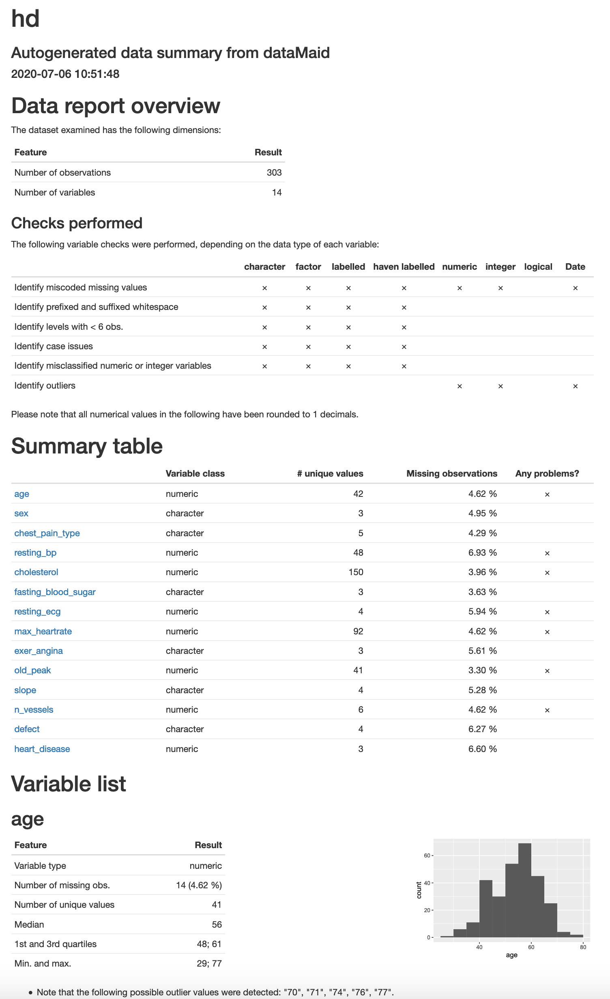

```{r setup, include=FALSE}
knitr::opts_chunk$set(
  echo = FALSE,
  message = FALSE,
  warning = FALSE,
  comment = NA,
  R.options = list(width = 120),
  cache.rebuild = FALSE,
  cache = TRUE,
  fig.align = 'center',
  fig.asp = .7,
  dev = 'svglite',
  dev.args = list(bg = 'transparent')
)

library(tidyverse)
library(kableExtra)
library(scico)
library(noiris)

kable_df <- function(..., digits=3) {
  kable(..., digits=digits) %>% 
    kable_styling(full_width = F)
}

rnd = tidyext::rnd
```

## Introduction

In R there are many tools available for exploring data.  However, in consulting I still see a lot of people using base R's <span class="func" style = "">table</span> and <span class="func" style = "">summary</span> functions, followed by a lot of work to get the result into a more presentable format.  My own frustrations led to me creating a package ([tidyext](https://m-clark.github.io/tidyext/)) for personal use in this area.  While that suits me fine, there are tools that can go much further with little effort. Recently, Staniak & Biecek @staniak2019landscape wrote an article in the R Journal exploring several of such packages, so I thought I'd try them out for myself, and take others along with me for that ride.

Note that these are first impressions, I haven't really dived deeply into any of the packages, and may be missing some things. But that is also part of the point for this sort of thing.  These aren't modeling packages, and we have a good idea of what we want in EDA, so these should be easy to pick up and use.

## Packages

```{r load-data, cache=FALSE}
pkg_downloads = read_rds('data/cran_downloads_pkgs.rds')
monthly_stats = read_rds('data/monthly_stats.rds')
```

I've updated the article's table 1, which adds roughly a year's worth of downloads.

```{r table-1}
pkg_downloads %>% 
  group_by(package) %>% 
  summarise(
    downloads = sum(count),
    debut = min(date)
    ) %>% 
  arrange(desc(downloads)) %>% 
  kable_df()
```

A more informative assessment of usage would be in average monthly downloads.

```{r avg-monthly-downloads}
monthly_stats %>% 
  distinct(package, average_monthly_downloads) %>% 
  arrange(desc(average_monthly_downloads)) %>% 
  kable_df()
```

Here is a visualization of their growth over time.


```{r cran-packs, echo=FALSE}
monthly_stats %>%
  filter(year_mo != '2020-Jul', package != 'janitor') %>% 
  ggplot(aes(x = year_mo, y = monthly_downloads, color = package)) +
  geom_hline(aes(yintercept = 5000), color = 'gray92') +
  geom_hline(aes(yintercept = 10000), color = 'gray92') +
  ggbump::geom_bump(size = .5, alpha = .5, show.legend = F) +
  # ggforce::geom_bspline0(size = .5) +
  ggrepel::geom_text_repel(
    aes(label = package),
    size = 2,
    show.legend = F,
    data = . %>%
      group_by(package) %>%
      filter(year == last(year), month  == last(month))
  ) +
  scico::scale_color_scico_d() +
  guides(x = guide_axis(n.dodge = 2)) +
  scale_x_discrete(breaks = paste0(2016:2020, c('-Jan', '-Jun'))) +
  scale_y_continuous(breaks = c(1000, 2500, 5000, 10000, 15000, 25000)) +
  labs(x = '', y = '', subtitle = "CRAN monthly downloads") +
  visibly::theme_clean()
```


### Selected packages

#### Arbitrary criteria

I'll outline my reasons for selecting some packages to explore and not others. These reasons are somewhat, but not necessarily, arbitrary, and may leave out some viable newer packages.  For the data scenario, I am assuming messy data of the sort that might have hundreds of columns of mixed data types, potentially with lots of missingness, attributes that are only applicable to subsets of the data (e.g. branching logic in surveys), etc.[^nottoomessy]

Here is my criteria for selection:


- Relatively more widely used
- I've used it before and want to revisit it
- I've heard of it before and want to try it
- I'm familiar with the package author's work
- Appears to be in active development (especially on GitHub) according to modern programming standards
- Good documentation

Things I'm not as concerned about:

- Anything that requires actual analysis.  I have no interest in bivariate statistical tests, PCA, imputation.  It likely isn't appropriate, and I could do better via other means.
- Visuals, though fundamental for data exploration, can usually be done better with even a modicum of effort, so this wouldn't be a big factor for me, and some common ones are poor for communication (e.g. histograms). However, if it saves me some time for initial presentations or something like that, all the better.


In the end, I would like a package that is well put together and will make common tasks easier for me and potentially save me time in creating reports/presentation.

#### Conceptual organization

Staniak & Biecek note two general phases of data exploration, each with specific tasks, based on the CRISP-DM standard @wirth2000crisp [^cripdm].

- Understanding
    - Description
    - Validity
    - Exploration

- Preparation
    - Cleaning
    - Derived Attributes

In the first place, I will focus on tools for understanding, particularly description and validity, as they refer to exploration tasks solely as visualization, which is a perk, but something I'm more inclined to do myself.

I'm definitely less interested in the preparation.  'Cleaning' in the article refers to mean/median imputation, something I've never bothered to do for reasons that have been noted in the statistical literature for a very long time.  The other transformations are easy, and probably should be explicitly documented in your code.  Furthermore, in creating derived attributes, things like category merging and standardization depend on the subset of the data used, so it would probably be better to be more explicit than automatic.  Also, if things like an automated PCA is viable for your situation, it probably is very simple data (i.e. all variables of the same type), in which case, most of these tools probably won't add much value to you anyway.

So with that in mind here are the ones I will explore (in alphabetical order):

- <span class="pack" style = "">arsenal</span>
- <span class="pack" style = "">DataExplorer</span>
- <span class="pack" style = "">dataMaid</span>
- <span class="pack" style = "">janitor</span> (not explored in the previous article)
- <span class="pack" style = "">SmartEDA</span>
- <span class="pack" style = "">summarytools</span>
- <span class="pack" style = "">visdat</span>

## The Data

I've chosen the heart_disease data available from the [UCI repository](https://archive.ics.uci.edu/ml/datasets/Heart+Disease) (object name `hd`). It contains a mixture of data types but isn't too unweildy, as it's already been cleaned and has few columns.  I've additionally added some random missingness, and created an `hd_sample` which has only a couple columns to cut down on the display.

```{r prep-data}
hd = noiris::heart_disease
hd_mat = as.matrix(hd)
hd_mat[sample(prod(dim(hd)), .05*prod(dim(hd)))] = NA

hd = as_tibble(hd_mat) %>% 
  mutate_at(
    vars(
      age,
      resting_bp,
      cholesterol,
      resting_ecg,
      max_heartrate,
      old_peak,
      n_vessels,
      heart_disease
    ),
    as.numeric
  ) 

hd_sample = hd %>% 
  select(age, cholesterol, resting_bp, sex, chest_pain_type)

hd %>% 
  DT::datatable(options = list(dom = 'tp', scrollX = T), rownames = F)
```


```{r set_echo_true, cache = FALSE}
knitr::opts_chunk$set(echo = TRUE)
```

## Data Description

For data description
dimensions variables number
variables variable type
meta-data size in RAM

### Preliminary

To give a sense of what my preference is, consider my own functions. The following actually calls a separate numerical summary function as well as a categorical variable function, and both return 'tidy' data frames that can immediately be used for presentation (e.g. kableExtra) and visualization (e.g. ggplot2), or drilling down to only selections of the output.

```{r tidyext}
library(tidyext)

describe_all(hd, extra = T)  # also describe_all_num, describe_all_cat
```

I also have options, such as the following.

```{r tidyext-options}
hd %>% 
  select(age, sex, heart_disease) %>% 
  describe_all(
  digits = 2,
  include_NAcat = FALSE,
  max_levels = 3,
  include_numeric = TRUE,  # allows numeric variables with few levels
  sort_by_freq = TRUE,
  extra = TRUE
)
```

For grouped output, I can use the underlying functions.  Here we look at summaries for numerical variables.

```{r numby}
hd %>% 
  num_by(
    main_var  = vars(age, cholesterol),
    group_var = sex,
    extra = TRUE
  )
```

The categorical variable functionality is very similar.

```{r catby}
hd %>% 
  cat_by(
    main_var  = chest_pain_type,
    group_var = sex
  )
```

As these are tidy tibbles, they are essentially ready for presentation.

```{r demokableExtra}
describe_all_num(hd) %>% 
  kableExtra::kable()
```

These serve most of my needs for initial peeking at the data.  They return a tibble/data.frame that makes for easy presentation and visualization.  The underlying code uses tidyverse and mostly adheres to standard programming conventions.  This is the same sort of thing I'm looking for.


### arsenal

We begin alphabetically with the <span class="pack" style = "">arsenal</span> package.  Here we use tableby for a generic summary as well as grouped summary. The result is markdown, so for presentation in an R Markdown document, one must use the chunk option `results='asis'`.

```{r arsenal-table-by, echo = T, results='asis'}
library(arsenal)
hd_sample %>%
  tableby( ~ ., data = .) %>%
  summary()

hd_sample %>%
  tableby(sex ~ ., data = .) %>%
  summary()
```

Here is an example of categorical-only output using freqlist.

```{r arsenal-cats, results='asis'}
with(hd, table(sex, chest_pain_type)) %>% 
  freqlist() %>% 
  summary()
```

Other options include a function for doing pairwise comparisons for a repeated measure[^nopair], comparing datasets, and doing a bunch of bivariate regressions.


#### Pros

The tableby summary is essentially a 'Table 1', which is an unfortunately named display of descriptive stats for a sample of a given study[^tableone]. My clients often want that, and I've actually used a package specifically geared towards that just to save me the headache (tableOne), so I definitely find that aspect useful.  However, Table 1's almost invariably have needless statistical output or analysis, and are not a model for reporting that I would choose to go for.  As you can see, the layout is not going to be viable for more than a few variables, though it is common practice to present them that way in journal articles regardless of verbosity/legibility.

#### Issues

I'm not thrilled with markdown output, as I have little control over it, but it's fine.  Also, the default layout is not so succinct, and it appears it's trying to emulate SAS functions, which are not models for presentation in my opinion. One can use a function to write the output of a single table to html, but I'd rather it just be amenable to the document I'm already creating, or create a report for me of all tables.  Lastly, I'm not crazy about using the <span class="func" style = "">summary</span> function to get the output.  The underlying list objects are not 'print ready', so using summary as an argument with default of TRUE would make more sense to me design-wise.


### DataExplorer

Now we move to <span class="pack" style = "">DataExplorer</span>.  Let's introduce the package with the introduce function.  I already like this, as it provides good info that extends what you'd get with str or glimpse.

```{r data-explorer-introduce}
library(DataExplorer)

introduce(hd)
```

It also can display this information visually in two different ways.  I like this, but can't say I'd ever have a reason to actually use it.


```{r data-explorer-plot_intro}
plot_intro(hd)
```

```{r data-explorer-plot_str}
plot_str(list(hd = hd, gapminder = gapminder_2019))
```


We can focus on the missingness, which is nice, but I don't find a use for bar simple bar charts, as they actually make the single row of information harder to parse.

```{r data-explorer-plot_missing}
plot_missing(hd_sample)
```

It can also plot distributions, e.g. bar and histograms, for the actual values of the categorical/discrete variables.

```{r data-explorer-plot_bar}
plot_bar(hd)
```

But this sort of thing only takes a couple lines of ggplot to do on your own, which you can then customize far more easily.

```{r data-explorer-plot_intro-ggplot}
hd %>% 
  select_if(is.character) %>% 
  pivot_longer(everything(), names_to = 'variable', values_to = 'value') %>% 
  ggplot(aes(x = value)) +
  geom_bar() +
  coord_flip() +
  facet_wrap(~ variable, scales = 'free') 
```


Similarly there are QQ plots, scatterplots and more. I always try to get people to try correlation plots in lieu of large correlation matrices, and <span class="pack" style = "">DataExplorer</span> provides this.  The nice thing is that it will automatically create indicator variables for levels of categorical variables, but beyond that there are issues.   For one, it's diagonal is reversed from the typical presentation of correlation matrices. If you don't drop the missing, the plot isn't very useful, because it will include NA as a factor level, but to its credit <span class="pack" style = "">DataExplorer</span> has an option to only focus on continuous or discrete output. In addition, 'centered' is a rather choice for alignment of the x axis in my opinion, so this would take additional work to make presentable.

```{r data-explorer-plot_corr}
plot_correlation(
  hd,
  ggtheme = theme_minimal(),
  cor_args = list("use" = "pairwise.complete.obs")
)
```

There are packages that do this specifically, such as <span class="pack" style = "">heatmaply</span>. Before these came around I already had my own function, that also does an internal factor analysis to sort the variables, and produces an interactive result.  So while so this aspect of <span class="pack" style = "">DataExplorer</span> might be useful to others, it doesn't appeal much to me, especially given the other issues.  

```{r visibly-corrheat}
hd %>% 
  select_if(is.numeric) %>% 
  select(-id) %>% 
  cor(use = 'pair') %>% 
  visibly::corr_heat()
```

If the various options of output, or only some of them, appeals to you, they can all be nicely wrapped up in an automatic report. Various settings for each type of output can be set with an additional function (configure_report) or just passing a list of arguments, including which functions to use, ggplot2 theme, etc.  You can see the report [here]().

<!-- ADD LINK -->

```{r data-explorer-report, eval=F}
create_report(
  hd,
  y = 'heart_disease',
  output_dir   = 'other_docs',
  output_file  = 'data_explorer_report.html',
  report_title = 'My Data Description'
)
```


#### Pros

I think many would like at least some functionality in <span class="pack" style = "">DataExplorer</span>, as well as many of the visualizations.  The ease with which to generate a report should also be sufficient for anyone's personal use, and with some tweaking, presentation to others.  It also uses data.table under the hood, so likely can handle large data with efficiency.

Not covered here, but <span class="pack" style = "">DataExplorer</span> also has functionality for feature processing and engineering, for example, collapsing sparse categories, dummy coding, etc.

#### Issues

The issues I have are pretty minor with this one aside from unnecessary statistical analysis and visualization choices.  I would also recommend `pryr::object_size` rather than base R's function.

### SmartEDA

I wanted to look at the <span class="pack" style = "">SmartEDA</span> package because the figure in the article was of a clean report.  Let's start our exploration with the basic ExpData function

```{r smarteda-expdata}
library(SmartEDA)
ExpData(hd)
```

We can look at ExpNumStat to get some basic stats for numeric variables.

```{r smarteda-expnumstat}
ExpNumStat(hd, round = 1)
```


We can look at ExpNumStat to get some basic stats for grouped output also, and set various options.

```{r smarteda-expnumstat-opts}
ExpNumStat(
  hd_sample,
  by = "GA",
  gp = "sex",
  Qnt = c(.1, .9),
  Outlier = TRUE,
  round = 1
)
```


There is also some visualization of relationships with a given target variable.

```{r smarteda-ExpNumViz}
ExpNumViz(hd_sample, target = 'cholesterol')
```

Here are the default categorical data summaries.  This is a nice and clean `data.frame` presentation.

```{r smarteda-ExpCTable}
ExpCTable(hd_sample) 
```

As there was with numeric variables, there is also visualization for the categorical variables.

```{r smarteda-ExpCatViz}
ExpCatViz(hd_sample) 
```

As far as reporting, <span class="pack" style = "">SmartEDA</span> also provides functionality.


<!-- ADD LINK -->

```{r smarteda-ExpReport, eval = F}
ExpReport(
  hd %>% select(-id),
  theme = visibly::theme_clean(),
  op_dir = 'other_docs/',
  op_file = 'smarteda.html'
)
```


#### Pros

<span class="pack" style = "">SmartEDA</span> is fairly intuitive to use. It returns a data frame, and some of the less verbose output is quite ready to go.  It can also generate a report in automatic fashion.

#### Issues

A lot of this isn't very useful to me, such as parallel coordinate plots, 'outlier' analysis, etc.  I'm not crazy about the naming conventions, both for the functions and arguments (every single function begins with `Exp`, so why use it?). The default color schemes for some output is simply not viable for presentation, and the report doesn't really have any options for controlling the output like <span class="pack" style = "">DataExplorer</span> did.


### summarytools

The <span class="pack" style = "">summarytools</span> package provides four main functions to work with, but I'm going to skip those and go straight to the tool that uses the key summary functions and puts it into a very nice presentation.


```{r summarytools-dfsummary, results='asis', cache.rebuild=F}
library(summarytools)

dfSummary(
  hd,
  varnumbers = FALSE,
  round.digits = 2,
  plain.ascii = FALSE,
  style = "grid",
  graph.magnif = .33,
  valid.col = FALSE,
  tmp.img.dir = "img"
)
```

This is exactly what I want- basic, not overwhelming and redundant information, a usable data.frame, simple visuals to enhance the output without adding to the total information you have to parse (and which can be turned off), and basic categorical information. In one function, I have pretty much all I'd need, but with control to tweak as necessary.

```{r summarytools-dfsummary-group-by, results='asis', cache.rebuild=F}
library(summarytools)

hd_sample %>% 
  group_by(sex) %>% 
  dfSummary(
    varnumbers = FALSE,
    round.digits = 2,
    plain.ascii = FALSE,
    na.col = FALSE,
    style = "grid",
    graph.magnif = .33,
    valid.col = FALSE,
    tmp.img.dir = "img"
  )
```


#### Pros

The summary tools package provides a single function that produces a ready-to-present table within whatever document I'm already using. Very nice!

#### Issues

The only nitpicky stuff I have with this package is that the <span class="func" style = "">ctable</span> function isn't useful to me, and some of the numeric description is not really necessary. 


## Data Validity

As a reminder, data validity is more about providing checks on the data rather than summarizing it per se.  These are packages more geared toward spotting or dealing with data issues.

### dataMaid

The primary utility of <span class="pack" style = "">dataMaid</span> is examination of data consistency, but it will also provide basic summaries too.  In the end it creates a report.  I came across this via the author's presentation at the Ann Arbor R User Group and have actually used it before.  The result can be found [here](), though here is a screenshot.

```{r datamaid-show, echo=FALSE}

```


It provides an overall summary of the data frame including variable types, unique values, missing percentage, and potential problems.  Problems mostly regard outliers, which is fine to inspect, but arbitrarily set.


<!-- ADD LINK -->

```{r datamaid-report, eval = FALSE}
library(dataMaid)

makeDataReport(
  hd,
  ouput = 'html',
  file = 'other_docs/datamaid_report.Rmd',
  replace = TRUE
)
```


#### Pros

<span class="pack" style = "">dataMaid</span> is highly customizable, but the default is already a great way to get a good sense of whether your data is doing what it's supposed to do.  In the past I've found it be slow in rendering the output

#### Issues

I couldn't get anything but a pdf document even though I clearly specified html as per the documentation, so I'm not sure what's going on there..  The default outlier check, while better than most would do, seemed too sensitive, but this is nitpicky.

### janitor

Sadly, I still regularly receive data from Excel (and SPSS), which means I have to worry about things that I shouldn't have to worry about, like whether dates will actually be treated appropriately, if the column names are usable, or whether the imported file contains 10000 empty rows because someone accidentally hit the space bar.  

The <span class="pack" style = "">janitor</span> package provides a few simple tools that many will probably find useful at some point, and I regularly use its remove_empty function after importing anything from Excel.  As an example I'll add an empty column with an Excel-like name, and a duplicated row.

```{r janitor-cleannames}
library(janitor)

hd2 = hd

hd2$`test this - ridiculous (name)` = NA
hd2$`why.is-this_here` = 'same value everywhere'
hd2[nrow(hd2) + 1,] = hd2[1,]

hd2 %>% 
  clean_names() %>% 
  colnames()
```

And here is the remove_* functionality.

```{r janitor-removempty.}
hd2 %>% 
  remove_empty() %>% 
  remove_constant() %>% 
  colnames()
```


Just a couple little things like that are very useful.  Otherwise, there is functionality for dates, tables, etc. that some might find useful in a pinch, but  probably will have more with the other summary functions in packages seen before, or more advanced users may simply just use lubridate etc.


#### Pros

Provides useful functionality not seen in the other packages. 

#### Issues

Not a whole lot going on here relative to some of the other packages, but what is there is likely to be useful to many.

### visdat

The package <span class="pack" style = "">visdat</span>[^visdescr] is, as its name implies, purely for visualization, and this includes missingness, correlation, and more.  We can start by visualizing the missing data.

```{r visdat-missing}
library(visdat)
vis_dat(hd_sample)
```

We can look at variable types along with the missingness.  I like the integer/double mix, which might point to an issue if all the data should be integer valued.

```{r visdat-guess}
vis_guess(hd)
```

Visualization of the correlations, default is pairwise.  This is probably the cleanest we've seen so far of this type of plot, but there is no way to order it meaningfully.

```{r visdat-cor}
vis_cor(hd %>% select_if(is.numeric))
```


One nice feature I haven't seen elsewhere is to visualize a given expected value across a data set.

```{r visdat-expect}
hd %>% 
  select(sex) %>% 
  vis_expect(expectation =  ~ .x == 'male')
```

We can also compare whole data sets. Here the differences are with missing values in one and not the other.

```{r visdat-compare}
hd2 = noiris::heart_disease %>% 
  select(colnames(hd_sample)) %>% 
  mutate_if(is.factor, as.character)

vis_compare(
  hd_sample,
  hd2
)
```


#### Pros

This package adds some useful functionality we haven't seen.  In addition, the underlying code adheres to open science standards.

#### Issues

This isn't for numeric description, so can only supplement typical EDA as we've had before. You may have to do some pre-processing for some functions unlike with other tools (e.g. subsetting to numeric).


## Data Cleaning and Transformations

As mentioned previously, I'm not interested in using these packages for doing this, and based on Staniak and Biecek, only a couple of them provide this, <span class="pack" style = "">DataExplorer</span> being the only package that we've explored here.  Mean/median/mode imputation is a great way to attenuate correlation, so I'm not interested in that.  I don't even know what an 'outlier' is outside of a modeling framework so I'm definitely not interested in doing something about those values based on a univariate analysis. Discretizing numeric variables should almost never be done[^discrete_exceptions], so that functionality is not desirable. And between base R functions like <span class="func" style = "">scale</span> and <span class="func" style = "">log</span>, or the <span class="func" style = "">rescale</span> function from <span class="pack" style = "">scales</span>, lumping factors and similar via <span class="pack" style = "">forcats</span>, I don't really need another package for this sort of thing.

## Summary

Here is a probably inaccurate list of features I made based on quick inspections.

```{r sumtable, eval = T, echo=FALSE}
tibble(
  Package = c(
    'arsenal',
    'DataExplorer',
    'SmartEDA',
    'summarytools',
    'visdat',
    'dataMaid',
    'janitor'
  ),
  `Ready to use output` = c(
    '',
    emo::ji('thumbsup'),
    emo::ji('thumbsup'),
    emo::ji('thumbsup'),
    emo::ji('thumbsup'),
    '',
    emo::ji('thumbsup')
  ),
  `Code Quality` = c(
    '',
    emo::ji('thumbsup'),
    '',
    '',
    emo::ji('thumbsup'),
    '',
    emo::ji('thumbsup')
  ),
  `Visualization` = c(
    '',
    emo::ji('thumbsup'),
    emo::ji('thumbsup'),
    emo::ji('thumbsup'),
    emo::ji('thumbsup'),
    emo::ji('thumbsup'),
   ''
  ),
  `Report Generation` = c(
    '',
    emo::ji('thumbsup'),
    emo::ji('thumbsup'),
    '',
    '',
    emo::ji('thumbsup'),
    ''
  ),
  `Dedicated Website` = c(
    emo::ji('thumbsup'),
    emo::ji('thumbsup'),
    emo::ji('thumbsup'),
    '',
    emo::ji('thumbsup'),
    '',
    emo::ji('thumbsup')
  )
) %>%
  kable_df(align = 'lcccccc')
```

- Ready to use output: supplies a data frame or ggplot class object.
- Code Quality: uses type-safe checks, active development (notable recent activity and response to issues), explicitly uses some standard (e.g. open sci), but mostly my own personal opinion.
- Visualization: includes at least some visualization aspect.
- Report Generation: has a function to report a separate html or pdf file of multiple results
- Dedicated Website: more than just a github repo, has a website with vignettes.  All of these packages are on GitHub, so with <span class="pack" style = "">pkgdown</span> there is no reason not to have this.


In general I would imagine I'd use <span class="pack" style = "">summarytools</span> or <span class="pack" style = "">DataExplorer</span>, with <span class="pack" style = "">visdat</span> and <span class="pack" style = "">janitor</span> to fill in additional information or help with the data processing.  Interestingly, these also appear to be the most popular packages under consideration[^janitorpop].

## Links

### Description packages

[arsenal](https://mayoverse.github.io/arsenal/)
[DataExplorer](http://boxuancui.github.io/DataExplorer/)
[SmartEDA](https://daya6489.github.io/SmartEDA/)
[summarytools](https://github.com/dcomtois/summarytools)

### Validation packages

[visdat](http://visdat.njtierney.com/)
[dataMaid](https://github.com/ekstroem/dataMaid)
[janitor](https://sfirke.github.io/janitor/)

## Exercises


[^tableone]: I see 'Table 1' used mostly by folks in medical fields, who subsequently place it as table 2, 3 or whatever as would normally be the case.

[^nottoomessy]: However, for our demonstration I'll be using something a little more wieldy.

 [^cripdm]: To be honest, I wasn't familiar with the CRoss Industry Standard Process for Data Mining until reading the article citing it. I don't get the impression any particular methodology is actually consciously thought about by the vast majority of practicing data scientists, but it's useful in providing a framework for the content here.
 
 [^nopair]: The data we're using isn't paired and their documentation doesn't provide a working example.
 
 [^visdescr]: The article by Staniak & Biecek places <span class="pack" style = "">visdat</span> with description rather than validity, but the data frame comparison, expectation investigation, and missing exploration seem more validity issues than data summaries.
 
 [^janitorpop]: The <span class="pack" style = "">janitor</span> package is notably more popular than any of the other packages.
 
 [^discrete_exceptions]: The only times I do this is with an already discrete variable, for example, going from 7 values to 5 values, or coarsening that might be applied in very large data situations for computational efficiency.